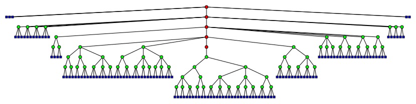

# persistring

## Пётр Портнов, ИУ8-55

Набор реализаций персистентных строк.

## Теоретическая часть

### Персистентные структуры данных

Персистентные структуры данных – это структуры данных, при внесениии изменений в которые, сохраняются все предыдущие состояния и доступ к ним.

В зависимости от возможностей, которые дыёт данная структура данных для взаимодействия с состояниями, персистентность подразделяется на:

- частичную – дающую возможность изменять только последнее состояние (остальные остаются доступными ттолько для чтения), т.е. строится некоторый стек версий
- полную – дающую возможность применять изменения к любому существующему состоянию, т.е. строится дерево версий
- конфлюэнтную – такую, что подобные структуры данных можно объединять
- функциональную – такую, в которой запрещены уничтожающие присваивания

## Способы создания персистентных строк

### Полное копирование

Наиболее простой, с точки зрения реализации, метод построения персистентных структур данных заключается в "наивном" копировании данных. То есть для каждой версии в истории полностью хранится данная версия.

**Преимущества**:

- простота реализации: метод применим к любой структуре данных, для которой определена операция копирования
- сохранение всех операций изначальной структуры данных: любые операции применимы к подобной персистентной структуре данных, потому что взаимодействие с версией сводится к взаимодействию со "снимком" данной версии, то есть изначальной структурой данных
- даёт полную персистентность

**Недостатки**:

- неэффективное потребление памяти: пусть каждая операция изменяет размер структуры данных на $1$, причём изначально размер структуры – $0$, тогда для $n$ операций сложность по памяти будет составлять: $1 + 2 + 3 + ... + n = {n(1 + n) \over 2} = O(n^2)$ 
- неэффективное время операций: поскольку каждая операция требует копирования текущего состояния, то, в лучшем случае, операция выполняется за $O(k)$,  где $k$ - размер текущей версии; тогда для сценария, когда размер объекта растёт с $0$ до $n$ по $1$ за операцию сложность по времени будет составлять: $O(n^2)$

### Метод копирование пути

Данный подход основывается на представлении структуры данных, как дерева, каждая операция в котором добавляет или убирает вершину. Тогда для создания новой версии создаётся новый корень, от которого далее, на основе старого, строится новое дерево такое, что для всех вершин, которые "затронули изменения" (то есть, те, которые лежат на пути к вставленной/удалённой вершине) происходит копирование, однако на остальные "старые" вершины дерево просто ссылается.

**Преимущества**:

- меньшее потребление памяти: с асимптотической точки зрения, при операции необходимо скопировать "обновлённый маршрут" длина которого сопоставима с высотой дерева, которая, при условии сбалансированности, составляет $O(log n)$
- меньшее потребление по времени: при условии, что дерево сбалансировано, и всего вершин – $n$, то все операции, необходимые для поддержания персистентности выполняются в нём за $O(log n)$

**Недостатки**:

- узкоприменимо: неудобно использовать для построения очередей (каждая операция будет вынуждать копировать все вершины), для построения структур с циклическими зависимостями (гораздо больше вершин становится "грязными" при изменениях)
- разбросанность по памяти: за счёт того, что данные расположены в вершинах, данные изначально не представимы в форме цельного отрезка данных, поэтому получение полного состояния может затрачивать значительно больше времени, например получение всего вида требует обхода графа в глубину

### Метод "толстых" узлов

Метод основа на том, что данные представляются как набор некоторых узлов, в которых происходят изменения и, при этом, каждый узел хранит свою историю версий. При обращение к некоторой версии узла, она находится (при хранении версий в форме дерева) за $O(log n)$. Также метож допускает хранение не актуальных состояний, а изменений, к ним привёдшим.

**Преимущества**:

- Локализация: изменения строго ограничены в "пространстве", а именно записаны лишь в непосредственно связанных с ними узлах.
- Полная персистнтность: довольно просто добиться полной персистентности, поскольку узлы могут содержать  информацию о нескольких параллельных версиях.

**Недостатки**:

- "Неестественны" для многих структур данных: во многих естественных сценариях изменения могут затрагивать сразу много "узлов", в связи с чем для одного изменения будет необхожимо обновлять множество историй.
- Потребление памяти: требует значительного потребления памяти для поддержания логов, но, при этом, данные одной версии в памяти расположены непоследовательно.

## Персистентные строки

Популярная персистентная структура данных – персистентные строки. Связано это с тем, что подобные СД зачастую нудны при реализации текстовых редакторов, в связи с чем в их использовании есть ряд особенностей:

- случайный доступ: обращения происходят по произвольным индексам (например, при редактировании текста не в конце)
- последовательное представление: строки должны быть представимы (за разумное время) как последовательная область памяти
- "значительные" изменения: зачастую, операции изменяют сразу большую порцию данных (например, при вставке скопированного текста)
- "богатый" набор операций: в связи с естественной необходимостью, на строках, как правило, определено множество различных операций разного рода (например, для строк может быть полезна операция копирования себя произвоьное число раз)

### Подходы к реализации персистентных строк

Персистентные строки в той или иной степени можно построить на основе описанных выше структур, однако многие из них окажутся неэффективными для решения этой задачи.

- Метод полного копирования удобен и прост в реализации, но страдает от своей "тяжеловесности", которая особенно проявляется на строках.
- Метод копирования пути неудобнен тем, что, (в исходном исполнении) распределяет данные разбросанно в памяти.
- Метод "толстых" узлов сложноприменим, поскольку в строке сложно выделить некоторые фиксированные узлы, поскольку по ходу взаимодействия структура текста модет значительно изменяться

#### Пальцевые деревья

Один из способов реализации персистентных строк – пальцевые деревья. Это форма 2-3-деревьев, которая направлена на оптимизацию операций образения к "краям" за амортизированно константное время. Этот эффект достигается за счёт того, что чем ближе к краю находится некоторый участок, тем короче путь до него от корня.

**Преимущества**:

- Наглядность: пальцевое дерево, в целом, легко воспринимается как текст (достаточно пройтись по вершинам слева-направо)
- Высокая эффективность *некоторых* типовых операций

**Недостатки**:

- Неудобны для реализации сложных операций: "нестандартные" операции сложно эффективно выразить пальцевыми деревьями
- Данные расположены в памяти произвольно: из заданной строки достаточно долго строится цельная строка,

### Rope

Этот подход строится на хранении дерева, содержащего в листьях целостные подстроки. При этом на путях к листьям хранятся лишь длины строк, образуемых данными вершинами. Объединяющие операции для него выражаются через создание общей вершины-родителя, а разрушающие – через рабиение вершин на меньшие.

**Преимущества**:

- Даннные представлены последовательными отрезками в памяти
- В случае балансированной структуры дерева, случайный доступ выполним за $O(log n)$

**Недостатки**:

- Для повышения эффективности операций, требуется выплонять балансирование дерева ($O(log n)$), в противном случае дерево зачастую вырождается в связный список

## Самостоятельная реализация

### Задача

Разработать интерфейс (типаж), описывающий персистентную строку и выполнить несколько различных реализаций его.

#### Типаж `PersistentString`

Поведение персистентной строки описано тремя семействами методов:

- методы взаимодействия с версией:
  - `fn version(&self) -> usize;`: получает текущую версию строки
  - `fn latest_version(&self) -> usize;`: получает наиболее позднюю версию строки
  - `fn try_switch_version(&mut self, version: usize) -> Result<(), VersionSwitchError>;`, `fn switch_version(&mut self, version: usize) {`: пытаются сменить версию строки на указанную
- методы чтения состояния:
  - `fn snapshot(&self) -> Cow<str>;` получает текущую строку как последовательный участок памяти; в случае, есди это возможно, должно избегаться копирование
  - `fn is_empty(&self) -> bool;` : проверяет, является ли строка пустой
  - `fn len(&self) -> usize;`: получает длину строки
- методы изменения (создания новой версии):
  - `fn pop(&mut self) -> Option<char>;`: пытается убрать последний символ строки
  - `fn push(&mut self, character: char);`: добавляет к строке последний символ
  - `fn push_str(&mut self, suffix: &str);`: добавляет к строке подстроку
  - `fn repeat(&mut self, times: usize);`: повторяет строку заданное число раз
  - `fn remove(&mut self, index: usize) -> char;`: удаляет символ строки по заданному индексу
  - `fn retain(&mut self, filter: impl Fn(char) -> bool);`: исключает из строки символы, не удовлетворяющие предикату
  - `fn insert(&mut self, index: usize, character: char);`: вставляет в строку символ
  - `fn insert_str(&mut self, index: usize, insertion: &str);`: вставляет в строку подстроку

## Автоматическое тестирование

Для проверки корректносит реализаций используется универсальный набор модульных тестов, который проверяет различные сценарии применения методов персистентных строк:

- `test_readonly_operations`: тестирование методов чтения
- `test_push_versioning`: тестирование операции `push`
- `test_push_str_versioning`: тестирование операции `push_str`
- `test_pop_versioning`: тестирование операции `pop_versioning`
- `test_repeat_versioning`: тестирование операции `test_repeat_versioning`
- `test_retain_versioning`: тестирование операции `retain`
- `test_insert_versioning`: тестирование операции `insert`
- `test_insert_str_versioning`: тестирование операции `test_insert_str_versioning`
- `test_push_versioning`: тестирование операции `push`

В данных тестах, в том числе, рассматриваются различные вырожденные случаи (например, вставка пустых строк), которые могут быть критическими для некоторых реализаций.

### `CowPersistentString`

Персистентная строка на основе копирования данных (Copy-on-Write). Для каждого состояния создаётся полная копия всей строки.

Операции чтения для заданной строки выполняются за время асимптотически равное времени этих операций у обычной строки, однако, как было замечено выше, прочие операции выполняются не менее чем за $O(l)$, где $l$ – текущая длина строки.

Затраты по памяти составляют $O(\sum_{i=1}^n |s_i|)$, где $|s_i|$ – длина $i^{ой}$ строки.

Худшим случаем для данной структуры является применение множества "мелких" изменений, потому что каждое из них требует создания полной копии. В таком случае для $n$ операций сложность можно будет оценить как $n^2$.

### `LongBufferPersistentString`

Главная проблема предыдущего подхода заключается в том, что каждая версия строка полностью хранится в памяти, несмотря на то, что изменения могут затрагивать лишь малую её часть. Поэтому, в качетсве альтернативы, подход с "длинным буфером" использует внутри себя единую область памяти для сохранения всех встречающиъся в версиях подстрок, в то время как сами версии представляют из себя лишь массивы указателей на соответствующие им области общего буфера. За счёт этого, значительно сокращается потребление по памяти на "естестсвенных сценариях". Вставка строки обходится как по памяти, так и по времени, в $O(d + l)$, где $d$ - количество сегментов в текущей версии, а $l$ - длина вставляемой подстроки. Операция `repeat(n)` обходится в $n$, поскольку всё, что ей необходимо выполнить – это продблировать сегменты (константного размера).

В это же время, основной недостаток этого подхода – большее потребление памяти при большом количестве сегментов, потому что кроме памяти, необходимой на поддержание буфера, в худшем случае, нужно будет и кратное количество памяти для хранения сегментов (вырожденный случай – все сегменты длины $1$).

Кроме того, при данном подходе случайный доступ может стоить линейной время, поскольку для него необходимо перебирать все сегменты от края.

### `RopePersistentString`

Для решения этих проблем можно использовать данную реализацию. Этот подход основан на методе Rope, однако включает в себя следующий модификации:

- для реализации полной персистентности операций, используется метод копирования пути, за счёт чего каждой версии соответствует свой корень дерева
- как и в случае `LongBufferPersistentString`, используется единая область памяти динамического размера, а вершины представляют собой единичные (но не обязательно длины $1$) сегменты

Эти изменения помогают добиться полной персистентности, которая ставилась как основная задача (и которую требюует интерфейс) и сократить потребление памяти без необходимости в использовании механизма автоматического управления памятью (вроде сборщика мусора).

В итоге, операции случайного доступа производят бинарный поиск от корня, выбирая ветви, соответствующие необходимому диапазону.

## Выводы

Персистентные структуры данных – мозный и гибкий инструмент, позволяющий решить проблему управления версиями некоторых данных.

Существуют различные подходы к их построению, начиная от наивного копирования версий и заканчивая сложными модификациями деревьев поиска.

Работа со строками, в том числе, асимптотическая оценка сложности для них – достаточно тяжёлое занятие, основные причины для этого:

- "нелинейность" операций при естественном их наборе: какие-то операции, изменяют длину строки линейно (воздействуя на единственный символ), в то время как другие могут значительно изменять её (как, например, операция repeat, кратно увеличивающая длину), в связи с чем при оценках стоитприходится идти на ряд допущений
- наиболее часто используемые кодировки используют различное число байт для кодирования различных символов (например, UTF-8).

## Список литературы

1. https://neerc.ifmo.ru/wiki/index.php?title=%D0%9F%D0%B5%D1%80%D1%81%D0%B8%D1%81%D1%82%D0%B5%D0%BD%D1%82%D0%BD%D1%8B%D0%B5_%D1%81%D1%82%D1%80%D1%83%D0%BA%D1%82%D1%83%D1%80%D1%8B_%D0%B4%D0%B0%D0%BD%D0%BD%D1%8B%D1%85
2. https://habr.com/ru/post/113585/
3. http://www.staff.city.ac.uk/~ross/papers/FingerTree.html
4. https://drops.dagstuhl.de/opus/volltexte/2020/13392/pdf/LIPIcs-ISAAC-2020-48.pdf
5. https://neerc.ifmo.ru/wiki/index.php?title=Rope
6. https://habr.com/ru/post/144736/

